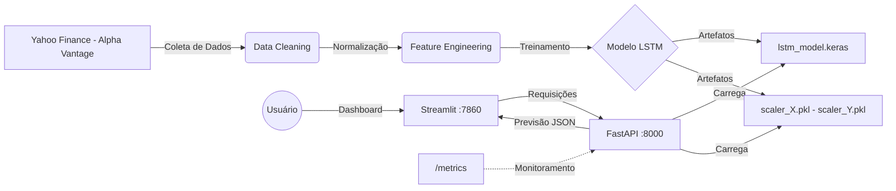

# 📈 Tech Challenge Fase 4: Previsão de Ativos com LSTM


---

## 🎯 Links Importantes (Para Avaliação)

<table width="100%">
<tr>
<td align="center" width="50%">

### 🎬 Vídeo da Apresentação
[](https://www.youtube.com/watch?v=SEU_VIDEO_ID)

**👆 Clique para assistir**

</td>
<td align="center" width="50%">

### 🚀 Projeto em Produção
[](https://huggingface.co/spaces/SEU_USUARIO/SEU_SPACE)

**👆 Clique para testar ao vivo**

</td>
</tr>
</table>

---

Projeto de conclusão da Fase 4 da Pós-Graduação em Machine Learning Engineering.
Este projeto implementa um pipeline MLOps completo: desde a coleta de dados financeiros até o deploy de um modelo de Deep Learning em produção via container Docker, incluindo um dashboard interativo para visualização e monitoramento.

---

## 🏛️ Arquitetura da Solução

O projeto foi desenhado seguindo princípios de microsserviços e reprodutibilidade. Abaixo, o fluxo de dados da solução:



---

## 📂 Estrutura do Projeto

A organização de diretórios segue o padrão funcional para separação de responsabilidades, garantindo modularidade e fácil manutenção:

```text
.
├── 📜 coleta_dados.py              # 📥 Script ETL para download de dados do Yahoo Finance
├── 🛠️ gerar_teste.py               # 🧪 Utilitário para gerar payload JSON de teste
├── 🐳 Dockerfile                   # 📦 Receita para containerização da aplicação
├── 🚀 run.sh                       # ⚙️ Script de inicialização (API + Dashboard)
├── 📋 requirements.txt             # 📚 Dependências e bibliotecas do projeto
├── 📖 README.md                    # 📄 Documentação Técnica
├── 📂 data/                        # 💾 Armazenamento de dados brutos
│   └── 📉 PETR4.SA.csv             # Histórico de preços da Petrobras
├── 📂 models/                      # 🧠 Artefatos binários do modelo treinado
│   └── 🤖 lstm_model.keras         # O modelo de Rede Neural serializado
├── 📂 notebooks/                   # 🔬 Laboratório de Experimentação
│   └── 📓 01_treinamento_lstm.ipynb  # Notebook Principal (EDA, Treino e Validação)
└── 📂 src/                         # 🚀 Código Fonte da Aplicação (Produção)
    ├── ⚡ app.py                   # API RESTful com FastAPI
    ├── 📊 dashboard.py             # Interface Web com Streamlit
    └── 📂 models/                  # Artefatos para produção (dentro do container)
        ├── lstm_model.keras
        ├── scaler_X.pkl            # Normalizador de entrada (MinMaxScaler)
        └── scaler_Y.pkl            # Normalizador de saída (MinMaxScaler)
```

---

## 🧠 Decisões Técnicas

### 1. Modelo: LSTM (Long Short-Term Memory)

Em conformidade com os requisitos mandatórios do **Tech Challenge Fase 4**, implementamos uma arquitetura baseada em **Redes Neurais Recorrentes (LSTM)**.

Esta escolha arquitetural é ideal para o problema proposto, pois as LSTMs superam modelos lineares tradicionais na captura de dependências de longo prazo e padrões não-lineares em séries temporais financeiras.

* **Input:** Janela deslizante (*sliding window*) de **60 dias**.
* **Métricas de Avaliação:** O modelo atingiu um **MAPE (Erro Percentual Absoluto Médio)** de **~2.25%**, validando sua capacidade preditiva sobre a tendência do ativo.

### 2. Backend: FastAPI

Utilizado em substituição ao Flask por ser assíncrono (ASGI), o que permite maior performance em inferência, além de gerar automaticamente a documentação Swagger/OpenAPI necessária para os testes da banca.

**Endpoints disponíveis:**

| Método | Endpoint | Descrição |
|--------|----------|-----------|
| `GET` | `/health` | Health check da API e status do modelo |
| `GET` | `/sample-data` | Retorna os últimos 60 dias de preços (Alpha Vantage ou cache) |
| `POST` | `/predict` | Realiza previsão de preço para o próximo dia |
| `GET` | `/metrics` | Métricas Prometheus para monitoramento |
| `GET` | `/docs` | Documentação Swagger interativa |

### 3. Frontend: Streamlit Dashboard

Interface web interativa que permite:
- **Simulador de Previsão:** Carregar dados reais e executar previsões visualmente
- **Monitoramento (Ops):** Acompanhar métricas de performance da API (requisições, latência, CPU, RAM)

### 4. Deploy: Docker

A aplicação foi containerizada para garantir que o ambiente de execução seja idêntico na máquina do desenvolvedor e no servidor de avaliação, eliminando o problema de "funciona na minha máquina".

O container executa ambos os serviços:
- **FastAPI** na porta `8000` (API de inferência)
- **Streamlit** na porta `7860` (Dashboard - porta padrão Hugging Face Spaces)

### 5. Estratégia de Janela Deslizante (Time Step = 60)

Para a estruturação dos dados, foi utilizada uma abordagem de **Janela Deslizante (Sliding Window)** com tamanho de 60 dias.

* **O que isso significa:** Para prever o preço do dia $D+1$, o modelo olha estritamente para os preços dos dias $D-59$ até $D$.
* **Por que 60 dias?**
    1. **Ciclo Trimestral:** 60 dias úteis correspondem a aproximadamente **um trimestre fiscal** (3 meses). Isso permite que a LSTM capture tendências de curto/médio prazo influenciadas por balanços e ciclos de mercado.
    2. **Memória da LSTM:** Uma sequência de 60 passos fornece "memória" suficiente para a rede detectar padrões gráficos (como tendências de alta/baixa), sem introduzir ruído excessivo de dados muito antigos que já não refletem a conjuntura econômica atual.

### 6. Monitoramento com Prometheus

A API expõe métricas no formato Prometheus através do endpoint `/metrics`, permitindo:
- Contagem de requisições por endpoint
- Latência média de resposta
- Uso de CPU e memória do processo


---

## 🚀 Como Executar

### Pré-requisitos

* Docker instalado.
* (Opcional) Chave de API do Alpha Vantage para dados em tempo real.

### Opção 1: Docker (Recomendado)

#### Passo 1: Construir a Imagem

```bash
docker build -t tech-challenge-fase4 .
```

#### Passo 2: Rodar o Container

```bash
# Sem Alpha Vantage (usa dados em cache)
docker run -p 7860:7860 -p 8000:8000 tech-challenge-fase4

# Com Alpha Vantage (dados em tempo real)
docker run -p 7860:7860 -p 8000:8000 -e ALPHAVANTAGE_API_KEY=sua_chave tech-challenge-fase4
```

Acesse:
- **Dashboard Streamlit:** http://localhost:7860
- **API Swagger:** http://localhost:8000/docs

### Opção 2: Execução Local (Desenvolvimento)

```bash
# 1. Criar ambiente virtual
python -m venv venv
source venv/bin/activate  # Linux/Mac
# ou: venv\Scripts\activate  # Windows

# 2. Instalar dependências
pip install -r requirements.txt

# 3. Iniciar API (Terminal 1)
uvicorn src.app:app --host 0.0.0.0 --port 8000 --reload

# 4. Iniciar Dashboard (Terminal 2)
streamlit run src/dashboard.py --server.port 7860
```

---

## 🧪 Testando a API

### Via Dashboard

1. Acesse http://localhost:7860
2. Clique em **"🔄 Carregar Dados"** para obter os últimos 60 dias
3. Clique em **"🚀 Realizar Previsão"** para ver o resultado

### Via CURL

```bash
curl -X 'POST' \
  'http://localhost:8000/predict' \
  -H 'Content-Type: application/json' \
  -d '{ "last_60_days": [30.5, 31.2, 31.0, 30.8, ... (60 valores)] }'
```

### Via Script Auxiliar

```bash
# Gera um payload JSON atualizado com dados reais da bolsa
python gerar_teste.py
```

### Verificar Saúde da API

```bash
curl http://localhost:8000/health
```

**Resposta esperada:**
```json
{
  "status": "healthy",
  "model_loaded": true
}
```

---

## 📡 Variáveis de Ambiente

| Variável | Descrição | Padrão |
|----------|-----------|--------|
| `ALPHAVANTAGE_API_KEY` | Chave da API Alpha Vantage para dados em tempo real | - |
| `API_URL` | URL da API FastAPI (usado pelo Dashboard) | `http://localhost:8000` |

---

## 📊 Performance do Modelo

O modelo apresenta convergência estável sem sinais graves de *overfitting*, como demonstrado pelas curvas de Loss durante o treinamento.

### Comparativo: LSTM vs Baseline (Naive)

O **Modelo Naive** (prever que o preço de amanhã será igual ao de hoje) serve como baseline para validar se a LSTM está agregando valor preditivo real.

| Métrica | Modelo Naive (Baseline) | Modelo LSTM |
|---------|:-----------------------:|:-----------:|
| **MAE** (Erro Absoluto Médio) | R$ 0.31 | R$ 0.54 |
| **RMSE** (Raiz do Erro Quadrático) | R$ 0.43 | R$ 0.75 |
| **MAPE** (Erro Percentual) | 1.01% | 1.75% |
| **sMAPE** (Simétrico) | 1.01% | 1.75% |
| **MASE** | 1.00 | 1.74 |

### Análise dos Resultados

> ⚠️ **Observação importante:** Os resultados mostram que o modelo Naive apresenta métricas melhores que a LSTM neste conjunto de teste específico. Isso é um fenômeno comum em séries financeiras, onde o comportamento de "passeio aleatório" (*random walk*) faz com que o preço do próximo dia seja altamente correlacionado com o preço atual.

**Interpretação:**
- O **MAPE de 1.75%** indica que, em média, o modelo LSTM erra ~1.75% do valor real
- Para um ativo na faixa de R$ 30, isso representa um erro médio de ~R$ 0.54
- A LSTM pode capturar **padrões de tendência** e **reversões** que o Naive não consegue, sendo potencialmente útil em cenários de maior volatilidade

---

## 🛠️ Tecnologias Utilizadas

| Categoria | Tecnologia | Versão |
|-----------|------------|--------|
| **Linguagem** | Python | 3.11 |
| **Deep Learning** | TensorFlow/Keras | 2.15+ |
| **API** | FastAPI | 0.109+ |
| **Frontend** | Streamlit | 1.30+ |
| **Visualização** | Plotly | 5.18+ |
| **Data** | Pandas, NumPy | 2.1+, 1.26+ |
| **ML Utils** | Scikit-learn, Joblib | 1.3+, 1.3+ |
| **Dados Financeiros** | yfinance, Alpha Vantage | - |
| **Monitoramento** | Prometheus | 7.0+ |
| **Container** | Docker | - |

---

## 👥 Autores do Projeto

| Membro | LinkedIn | GitHub |
|:--- |:---:|:---:|
| **Andrea Sakai** | [](https://www.linkedin.com/in/andr%C3%A9a-sakai-63751732/) | [](https://github.com/andreaono/) |
| **Bruno Ferreira** | [](https://www.linkedin.com/in/bferreira-dev/) | [](https://github.com/Bruno-Ferr) |
| **Glauberthy Cavalcanti** | [](https://www.linkedin.com/in/glauberthy/) | [](https://github.com/glauberthy) |

---

## 📜 Licença

Este projeto foi desenvolvido para fins acadêmicos como parte do programa de Pós-Graduação em Machine Learning Engineering da FIAP.
